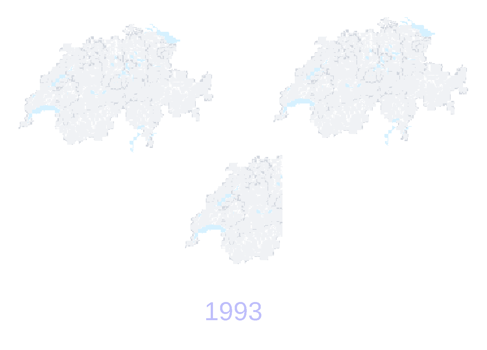

Food is not just food. Nowadays, people are aware that the source of your food is much more than just a label. Where food comes from defines the price. Your avocados crossed an ocean, they are going to be expensive. But a product’s origin can mean so much more. The food you produce has a carbon foot-print. Depending on the country, workers might not be treated humanely. Some countries, might even have diseases for specific crops, while other  countries don’t. Careful with that banana you bought at the airport, you wouldn’t want bananas to go extinct, [again](<https://www.youtube.com/watch?v=ex0URF-hWj4>). As 21st century “smart” consumers, we are aware that we should always ask ourselves the question: where does my food come from?

But have you ever asked yourself: _why_ does my food comes from the places it does?

Here we look at examples of how various factors, from population growth to consumer demands, can affect the production and international trade of crops. Our aim is to show you how multiple factors have come together to change the global crop market over the past two decades. These global changes, ultimately have had surprising and often undesirable effects on individual countries.

Hereunder is shown a stackplot of the evolution of the proportion of the world's most commonly traded commodities, by weight, in 2016. You can click on one of the items to the see the trade distribution without it.

<iframe
    src="assets/html/Globaal_trade_item.html"
    height="550"
    seamless="seamless"
    frameBorder="0">
</iframe>

Since 1993, the type of crops that are traded have not changed much. Despite what social media might make you believe, super-food have not completely changed what people produce, trade, and consume. Since 1993, the most traded products have by far been wheat, maize, and soybean. While these are staple foods throughout the world, they are not produced at much higher quantities than other staples like potatoes and rice. The real driver behind the trade of these three products is animal feed and biofuel production [^1].

[^1]: Cassidy, Emily S., et al. "Redefining agricultural yields: from tonnes to people nourished per hectare." Environmental Research Letters 8.3 (2013): 034015.

However, who exports and who imports crops has significantly shifted in the past two decades. China has become the primary importer of agricultural products by tonnes on the planet, while Brazil has risen as a major producer and exporter.

This first map displays all trades with edges. The slider can be moved to change years. The thickness of the lines is proportional to the amount traded, and the size of the points represent the total import for a country. The color of each country represents its total production. All European Union members are grouped as a single entity. The maps further down have the same information for specific products.

<iframe
    src="assets/html/world_trade.html"
    height="550"
    seamless="seamless"
    frameBorder="0">
</iframe>



In 1993, China imported 2.7 % of all agricultural products traded in the world, by 2016 this became 14.5%. Most of this change is due to soybean. In 1993 soybeans represented only 1.3% of China’s agricultural imports, but by 2016 it became 69.8%.

<iframe
    src="assets/html/china_import_soy.html"
    width="820"
    height="420"
    seamless="seamless"
    frameBorder="0">
</iframe>

In 1995, Brazil started trading soybeans with China, only supplying 1.4% of its soybean import. By 2013 Brazil became the supplier of almost half of the chinese soybean import. In 2016, 38.6 million tonnes of soybean.

Brazil is almost at the [antipode](https://en.wikipedia.org/wiki/Antipodes) of China. Considering all of humans on earth collectively weigh [60 million tonnes](https://www.vox.com/science-and-health/2018/5/29/17386112/all-life-on-earth-chart-weight-plants-animals-pnas). The china brazil soybean trade moves the equivalent of half of the people on earth, halfway across the world, every year. This staggering amount of soybean is not destined for human consumption. Most of the soybean imported by China is used for feedstock in the pork-meat industry[^2].

[^2]: <http://www.earth-policy.org/mobile/books/fpep/fpepch9>

Brazil’s trade policies used to be mostly oriented inwards. In the early 90’s, Brazilian exports remained relatively constant, mainly due to an unstable macroeconomic and international context. During this time, it liberalized its trade regime.  A surge in agricultural production at the end of the decade, along with sound macroeconomic policies, helped it gain momentum. This way, Brazil quickly established itself as one of the main trade giants in the world[^3].

[^3]: Moreira, Mauricio. (2009). Brazil's Trade Policy: Old and New Issues. SSRN Electronic Journal. 10.2139/ssrn.1555947.

<iframe
    src="assets/html/top10Brazil.html"
    width="800"
    height="550"
    seamless="seamless"
    frameBorder="0">
</iframe>

Expanding trade regimes, as well as increasing production and exports, increase GDP, but at what cost? To be able to fulfill the demand of that much soybeans and maize, Brazil has had to find more arable land. The consequence is the deforestation in the Amazon, and ultimately the exacerbation of climate change. This uncontrollable urge to expand has to be regulated if we want to have a chance to reduce the effects of climate change and to preserve the biggest rainforest in the world. Visualized through the size of Switzerland, the land used by Brazil over the years for soybean is astonishing[^4].

[^4]: Faria, Weslem Rodrigues, and Alexandre Nunes Almeida. “Relationship between Openness to Trade and Deforestation: Empirical Evidence from the Brazilian Amazon.” Ecological Economics, Elsevier, 29 Nov. 2015

By sheer volume, soybeans stand out as the most traded crop of the last decade. However, many other crops have interesting trade and production patterns without representing a large portion of global trades. To identify these crops, the [Hills number](https://en.wikipedia.org/wiki/Diversity_index) was used. This metric quantifies the diversity in producers for each crop. How this number changes over time can highlight whether crops are being produced by fewer or more countries. Sesame seeds stood among the crops with the largest increase in diversity.



While studying China, we notice another interesting trend. Traditionally, most sesame seeds were produced in Asia (specifically India, Myanmar, and China). Since 2010 however, various central and southern african countries have drastically increased their sesame seed production. At the same time production in China and India have decreased.

<iframe
    src="assets/html/sesame_trade.html"
    width="800"
    height="550"
    seamless="seamless"
    frameBorder="0">
</iframe>

The rise of sesame seed is production in Africa is mainly due to exportation as a cash crop. In 2016, 16.0% of the African sesame seed production was directed towards Asian countries.

Tanzania is among the largest producers of sesame seeds in the world. In 2015, it alone produced 20.6% of worldwide sesame seeds, and exported 12.2% of its production. That year, Tanzania’s sesame seeds represented 6.6% of the total sesame traded.

Improvements in infrastructure allowed local farmers to directly sell their sesame seeds to the global market. This influx of cash drove the increase in production. However, the wealth brought by sesame seeds has been accompanied by a widening economic inequality, not just between urban and rural areas, but within rural areas as well[^5]. While part of the sesame seed production is destined towards local markets, it also refined into sesame seed oil. Sesame seed oils are not reported in the dataset, as such, the values above represent only a part of the sesame seed production destined for trade.

[^5]: Brockington, Dan. "Persistent peasant poverty and assets. Exploring dynamics of new forms of wealth and poverty in Tanzania 1999–2018." The Journal of Peasant Studies (2019): 1-20



Embargos, tariffs, and bans are some of the tools available to governments to influence trade routes. In 1914 the United States placed a ban on avocados to limit the spread of fruit flies. During most of this period, California provided most of the necessary avocados for the US. By 1993, the main exporter of Avocados to the US was Chile.

<iframe
    src="assets/html/avocado_trade.html"
    width="800"
    height="550"
    seamless="seamless"
    frameBorder="0">
</iframe>

In the meantime, the world’s major avocado producer, Mexico, mostly traded with Europe.

In 1994, due to the North American Free Trade Agreement (NAFTA), Mexican avocados entered the American market. An avocado explosion followed: in 2016, 76% of the total exports of Avocados from Mexico went to the US, compared to only 13% in 1994. While Mexico’s avocado production was able to follow demands, recently, a combination of decreased production, increased demand, and drug cartels have led to a [guacamole crisis](https://www.dw.com/en/mexico-facing-a-guacamole-crisis/a-49703429) in Mexico.

In the European Union, the demand for Avocado has also exploded: imports increased from 170 thousand tonnes in 1994 to 1810 thousand tonnes by 2016. The main exporters appear to be South Africa, Mexico, Israel and Kenya, and in the most recent years Peru and Chile.

Traditionally, France was the largest importer, along with the U.S., the United Kingdom, Germany, Canada and the Netherlands. In 2004, the U.S. got first in the rank and kept increasing their imports at a faster rate than the rest. Much smaller countries, like the Scandinavian ones, appear in the top-10 rank due to an increased attention for [health food](https://www.cbi.eu/market-information/fresh-fruit-vegetables/avocados/europe/)

Spain is the most important producer of avocados within Europe. It was the main european exporter of avocados until 2006, when the Netherlands surpassed it. Despite not producing avocados, the Netherlands is a major avocado exporter. This is due to its role as a trade hub; large volumes are re-exported mainly to countries inside the EU. In 2016, 28.9% of their exports were to Germany, followed by France (10.5%) and Sweden (8%).



Beyond governmental policies, consumers can be a major driving force for agricultural trade. Quinoa is another example of a “trending product” whose increasing popularity has had an impact on its producers.

<iframe
    src="assets/html/quinoa_trade.html"
    width="800"
    height="550"
    seamless="seamless"
    frameBorder="0">
</iframe>

The majority of quinoa exports are towards first world economies, mainly the United States, Canada and Europe. It catches the attention that the Netherlands appears again as the most relevant exporter in country. In 2016, over 80% of their imports were re-exported to the rest of the European countries, mainly to Austria, Germany, France, Italy and Belgium.

<iframe
    src="assets/html/top10Quinoa.html"
    width="800"
    height="550"
    seamless="seamless"
    frameBorder="0">
</iframe>

Quinoa is native to the Andean plateau, meaning only Ecuador, Bolivia, and Peru have the adequate climate cultivate. Despite Peru and Bolivia being the main producers worldwide, it is not until 2011 that Peru enters the market, highly increasing their production and becoming the main exporters by 2014.

From 2014 to 2016 most of the increasing Peruvian quinoa production was exported to other countries. During this period, the amount of quinoa per person, produced for national markets, stayed relatively constant despite population growth. An analysis of household expenditures of Peruvian families showed that increasing global quinoa prices had modest economic repercussions within the country[^6].

[^6]: Bellemare, Marc F., Johanna Fajardo-Gonzalez, and Seth R. Gitter. "Foods and fads: The welfare impacts of rising quinoa prices in Peru." World Development 112 (2018): 163-179.



The path crops take to your plate are diverse. The reasons why they take this journey are even more diverse.

The list of items that we analyzed is not exhaustive. Their trade routes are affected by factors unique to each of them, however, these all share a trend. Food is affected by globalization. What people produce, on a global scale, has not changed. What has changed is how much and for who.

Technological improvements have made the global market more accessible than ever.  With growing incentives to trade local products, countries have been opening up their borders. For an an ever smaller world, the repercussions have been large.

### References
