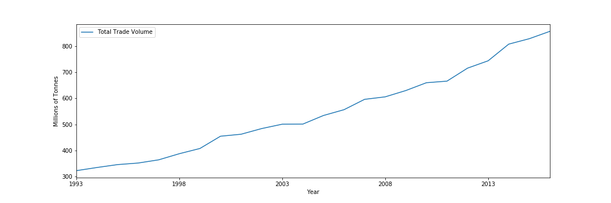

Food is not just food. Nowadays, people are aware that the source of your food is much more than just a label. Where food comes from defines the price. Your avocadoes crossed an ocean, they are going to be expensive. But a product’s origin can mean so much more. The food you produce has a carbon foot-print. Depending on the country, workers might not be treated humanely. Some countries, might even have diseases for specific crops, while other  countries don’t. Careful with that banana you bought at the airport, you wouldn’t want [bananas to go extinct](<https://edition.cnn.com/2015/07/22/africa/banana-panama-disease/index.html>), again. As 21st century “smart” consumers, we are aware that we should always ask ourselves the question: where does my food come from?

But have you ever asked yourself: why does my food comes from the places it does?

Here we look at examples of how various factors, from population growth to consumer demands, can affect the production and international trade of crops. Our aim is to show you how multiple factors have come together to change the global crop market over the past two decades. These global changes, ultimately have had surprising and often undesirable effects on individual countries.

Since 1993, the type of crops are traded have not changed much. Despite what social media might make you believe, super-food have not completely changed what people produce, trade, and consume. Since 1993 the most traded products have by far been wheat, maize, and soybean. While these are staple foods throughout the world, they are not consumed more than other staples like potatoes and rice {LINK}. The real driver behind the trade of these three products is animal feed. INSERT(What percent is used for animal feed).

<iframe
    src="assets/html/world_trade.html"
    height="550"
    seamless="seamless"
    frameBorder="0">
</iframe>

However, who exports and who imports crops has significantly shifted in the past two decades.

China has become the primary importer of agricultural products by tonnes on the planet, while brazil has risen as a major producer and exporter. When looking at China, we can see that their exports seem to stay constant while imports rise.

But what are they importing.



They mostly import soy.

<iframe
    src="assets/html/china_import_soy.html"
    width="820"
    height="420"
    seamless="seamless"
    frameBorder="0">
</iframe>

* What do they use it for?
  * Pig feed
* Where do they import it from?
  * Brazil and the USA
  * USA exports stay constant.
  * Brazil exports explode.
* How has this affected Brazil?
  * Increase in land use

Brazil's trade policies were mostly oriented inwards in the past. However, in the early 1990s, it liberalized its trade regime and quickly established itself as one the main trade giants in the world. Furthermore, we notice that the growth is not exactly linear, as we notice a certain plateau in the exports between 1993 and 1996. This was mainly due to a an unstable macroeconomic and international context. A surge in production at the end of the 1990s, along with sound macroeconomic policies, helped Brazil gain momentum and increase their exports.

<iframe
    src="assets/html/top10ExportedBrazil.html"
    width="800"
    height="550"
    seamless="seamless"
    frameBorder="0">
</iframe>

<iframe
    src="assets/html/top10ProducedBrazil.html"
    width="800"
    height="550"
    seamless="seamless"
    frameBorder="0">
</iframe>

Brazil mainly exports soybeans and maize, as it holds close proximity to the market of livestock and poultry.

<iframe
    src="assets/html/areaHarvestedGif.html"
    width="800"
    height="550"
    seamless="seamless"
    frameBorder="0">
</iframe>

Expanding trade regimes as well as increasing production and exports mean GDP growth, but at what cost? To be able to export that much soybeans and maize, Brazil has to find more arable land. And where else can it find it than in the Amazon? The promotion of those products is a major driver for deforestation in the Amazon, which contributes directly to climate change. This uncontrollable urge to expand has to be regulated if we want to have a chance to reduce the effects of climate change.



When studying China, we notice another interesting trend.

<iframe
    src="assets/html/sesame_trade.html"
    width="800"
    height="550"
    seamless="seamless"
    frameBorder="0">
</iframe>

* Sesame seed production has migrated from Asia to Eastern Africa
* Why?
* How?
* How does this affect Eastern African communities



What happens to the global trade of products that become health crazes?

* Let's look at avocados

<iframe
    src="assets/html/avocado_trade.html"
    width="800"
    height="550"
    seamless="seamless"
    frameBorder="0">
</iframe>



<iframe
    src="assets/html/quinoa_trade.html"
    width="800"
    height="550"
    seamless="seamless"
    frameBorder="0">
</iframe>

* Let's look at Quinoa
* Peru's emergence as an exporter
* Its popularity (Google Trends)
* Netherlands as Europe's dealer
