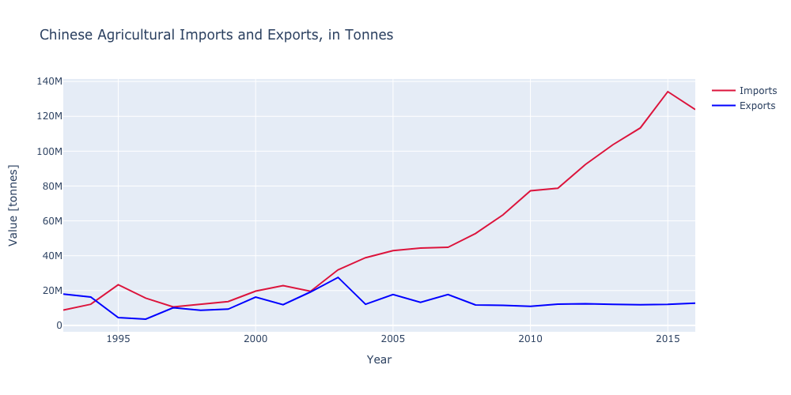

//bundle exec jekyll build

## Introduction

We studied how agricultural trade has changed between 1993 and 2016, using data from the FAO (Food and Agriculture Organisation).

## Global Trade

Trade has increased so much between 1993 and 2016.

### New Trade Countries

Brazil has emerged as an exporter.

China has emerged as an importer.

Some products, little known in 1993, are now massively popular in different regions across the world.

## TEXT

We all have heard about "globalization" and how it has changed the way we trade. Think about it, how much of the food you consume has been produced locally? Did people have acces to all these international products before? Have you ever seen your grandma (or grandpa) cooking this fancy thing called "quinoa" that flies from another country? Yes, GLOBALIZATION is a fact, but how is it really changing worldwide?

Do not be impatient, we are going to discover it! But, first of all...

**Has the production also increased over the past two decades?**

(GRAPH)

As you may have predicted, production has almost double: we are more habitants, so it seems pretty obvious, right? But oh man was going on with the trade... We have almost tripled it! Let's look a little bit deeper to find the ambitious countries that are importing soooo much.

(Import over the years map)

**From Japan to China!** In 1993 Japan was the country that had the most imports (in tonnes) compared to the rest of countries... but something has clearly changed: now China is the imports-Queen, but *Why?* Before answering, let's take a look to the exports...

(Export over years map)

The United States is still the main exporter, but one country seems to be increasingly joining the *let's export* trend: Brazil!

So we have seen changes in **China** and **Brazil**: any relationship within them? Let's analyze the main **trading routes** from 1993 to 2016

(Trading routes)

Back to 1993, main trade line: U.S.-Japan, from the main exporter to the main importer by the time. But one line trade seems to become more and more important over the years: **Brazil-China!** So yes, it seems that our new relevant exporter is trading a lot with the importer-Queen, but which kind of products?

(SOYBEANS --> Graph)

And what about U.S. China?

(Graph)

Fake graph:

<iframe
    src="supercool_map.html"
    width="100%"
    height="400"
    seamless="seamless"
    frameBorder="0">
</iframe>

## Countries

### China

We have seen that China has become the largest importer of agricultural products in the world. But how exactly has China's imports changed? Here is a look at total Chinese imports, between 1993 and 2016.

As we can see Chinese imports skyrocket but their exports stay more or less stable. But what do they import? Here are the 5 products most imported in China in 2016, and their evolution since 1993. Here is a stackplot of imports.

<iframe
    src="img/china_import_soy.html"
    width="800"
    height="400"
    seamless="seamless"
    frameBorder="0">
</iframe>

What do they use it for?

To feed pigs.

Why do they import it?

Due to policies. They do not want to depend on imports for grain.

How has their total production changed in that time?

Production increases, but not for soy.

How have their exports changed?

They haven't.

### Brazil

Brazil has emerged as one the worlds largest exporters.

They mostly trade with China.

They produce a lot of soy.

How has their arable land increased?

Where did it increase? (Amazon duh)

## Products

### Avocados

Avocados have become greatly popular.

They are mostly imported to the USA, from Mexico.

This wasn't the case in 1993.

Mexico was already an important exporter, but they exported mostly to Israel?

### Quinoa

Quinoa was totaly unknown in Western Europe and the USA in 1993.

It became a health food craze, and what was once a crop only eaten in Peru and Bolivia is now consumed in the whole world.

## Conclusions

Here are our conclusions.

Trade has changed.

Its great, but also sucks.
